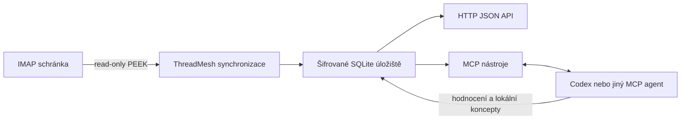

# ThreadMesh

[English](README.md) | [Česky](README.cs.md)

ThreadMesh je self-hosted PHP nástroj pro čtení nových IMAP e-mailů a jejich zpracování pomocí AI agenta. Agent může rozpoznat důležité zprávy a faktury, uložit strukturované hodnocení a připravit koncept odpovědi. Projekt funguje na Windows, Linuxu i macOS jako Composer knihovna nebo malá samostatná služba.

> Projekt je před prvním vydáním. První veřejná verze bude `v0.1.0-alpha.1` po ověření end-to-end scénáře se skutečným IMAP účtem.

## Co projekt obsahuje

- Frameworkově nezávislý doménový model a inkrementální synchronizaci.
- Read-only IMAP konektor používající PEEK, UID cursor a kontrolu UIDVALIDITY.
- SQLite databázi v jednom souboru a idempotentní ukládání e-mailů.
- Šifrování IMAP hesel pomocí XChaCha20-Poly1305.
- HTTP JSON API chráněné Bearer tokenem.
- Lokální streamable HTTP MCP server pro Codex a další MCP klienty.
- Hodnocení e-mailů, upozornění, údaje o fakturách a lokální koncepty.
- Volitelné uložení potvrzeného konceptu do IMAP Drafts. ThreadMesh neumí e-mail odeslat.

ThreadMesh sám neobsahuje jazykový model. Rozhodování provádí připojený ChatGPT/Codex nebo jiný agent prostřednictvím MCP nástrojů.



## Příklad: každodenní kontrola faktur

Lokální automatizace může načíst nové zprávy, nechat připojeného agenta klasifikovat dosud nevyhodnocené e-maily a uložit podezření na fakturu včetně uvedené částky, splatnosti a doporučeného dalšího kroku. Výsledek je následně dostupný přes `list_mail_alerts`. Agent může připravit lokální koncept odpovědi, ale ThreadMesh nikdy fakturu nezaplatí ani e-mail neodešle.

## Požadavky a instalace

- PHP 8.2+ s PDO SQLite, Sodium, JSON a Mbstring
- Composer 2

```bash
composer require threadmesh/threadmesh
```

Před prvním vydáním naklonujte repozitář a spusťte `composer install`.

Pro kontejnerové lokální spuštění použijte [český Docker návod](docs/docker.cs.md). Spustí API i MCP server se společným persistentním SQLite volume.

## První nastavení

Jednou vygenerujte master key a uložte jej mimo databázi, ideálně do správce hesel nebo secret store:

```bash
php bin/threadmesh key:generate
```

Nastavte proměnné prostředí:

```text
THREADMESH_MASTER_KEY=<32bytový klíč v base64>
THREADMESH_API_TOKEN=<dlouhý náhodný bearer token>
THREADMESH_DB=/absolutni/cesta/threadmesh.sqlite
```

Spusťte lokální API:

```bash
php -S 127.0.0.1:8080 -t public public/router.php
```

Účet nakonfigurujte pomocí `POST /v1/accounts`:

```json
{
  "id": "work",
  "displayName": "Pracovní e-mail",
  "secret": "app-password",
  "enabled": true,
  "configuration": {
    "host": "imap.example.com",
    "port": 993,
    "encryption": "ssl",
    "validateCertificate": true,
    "username": "me@example.com",
    "draftFolder": "Drafts"
  }
}
```

Následně otestujte `/v1/accounts/work/test`, načtěte seznam složek z `/v1/accounts/work/folders` a vybrané složky inicializujte přes `/v1/accounts/work/initialize`. Inicializace začne na aktuálním nejvyšším UID, takže se neimportuje starší historie.

## MCP a automatizace

MCP server spusťte na `http://127.0.0.1:8081/mcp`:

```bash
php bin/threadmesh-mcp
```

Port lze změnit proměnnou `THREADMESH_MCP_PORT`. Server je z bezpečnostních důvodů dostupný pouze na loopback rozhraní. Pro vzdálený provoz je nutná autentizovaná HTTPS brána.

Agent může synchronizovat poštu, číst nezpracované e-maily, ukládat hodnocení, zobrazovat upozornění a vytvářet lokální koncepty. Uložení do IMAP Drafts vyžaduje výslovné potvrzení. Odeslání e-mailu není podporováno.

Podrobnosti najdete v [MCP návodu](docs/mcp.md), [českém návodu k automatizaci](docs/automation.cs.md) a [hotovém českém promptu](examples/codex-prompt.cs.md).

## Bezpečnost a vývoj

Obsah e-mailu je vždy nedůvěryhodný a nesmí být interpretován jako instrukce pro agenta. Binární přílohy se do SQLite neukládají. Chraňte databázi, master key i API token a nevystavujte lokální API nebo MCP přímo do internetu.

```bash
composer check
```

Projekt je dostupný pod [MIT licencí](LICENSE). Další dokumentace: [HTTP API](docs/api.md), [Docker](docs/docker.cs.md), [architektura](docs/architecture.md), [bezpečnost](SECURITY.md) a [přispívání](CONTRIBUTING.md).

## Současná omezení

ThreadMesh je raná alfa verze určená pro lokální ověřování a integrační práci. Zatím nepodporuje historický import, OAuth, odesílání přes SMTP, fulltextové vyhledávání, webové UI ani víceuživatelské přihlášení. Pro IMAP používá heslo nebo app password. U příloh ukládá metadata, nikoli binární obsah. Hodnocení AI agenta není ověřením odesílatele, faktury, odkazu ani přílohy.

## Komerční podpora

ThreadMesh je open source pod licencí MIT. Autor [Radovan Kraus](https://github.com/vrapa) nabízí komerční PHP vývoj, vlastní IMAP/Jira/Bitbucket konektory, integrace pro Nette a Symfony, self-hosted nasazení a automatizace pracovních postupů s AI.
